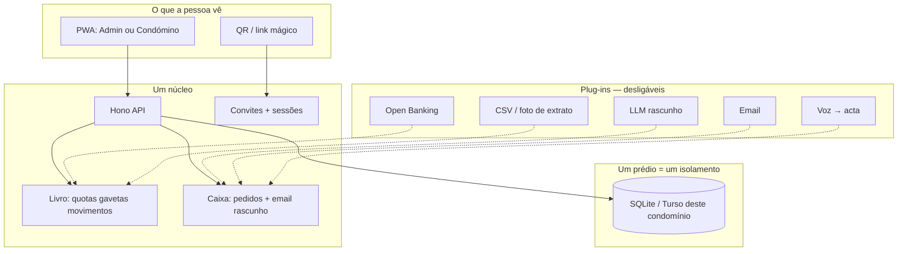

# Compilado Miro — LUMEN × branch `dev` × filtro de simplicidade

Data: 2026-09-02  
Fontes: estrutura Gemini (visão “Jobs”), código real em `rpcarvalho8/condominio` **branch `dev`** @ `fb69a83`, dossiê anterior.

Isto é o que colar no Miro. Não é um segundo produto. É a **mesma app do teu prédio**, despida do que é teatro e ancorada no que já funciona.

---

## 0. O cartão que vai ao centro do quadro

**Uma frase**

> O vizinho sabe o que deve. O administrador não precisa de uma empresa para o provar. O prédio não fica refém de ninguém.

**Três ecrãs. O resto é ruído.**

1. **A verdade** — quanto há na conta, em que gaveta, quem deve.
2. **O gesto** — confirmar um movimento, aprovar uma acta, reportar uma lâmpada.
3. **A entrada** — o vizinho aponta o telemóvel e está dentro.

Se um cartão do Gemini não serve um destes três, é satélite. Satélites não entram no v1 de mercado.

**Slogan (ficar com um)**  
«O seu prédio. Simples como deve ser.» — isto está certo.  
O nome **LUMEN** é aceitável (curto, claro). **Ninho** é mais quente e mais português. Não decidas o nome no Miro da arquitectura. Decides o nome quando o segundo condomínio existir. Até lá, no quadro: **LUMEN (nome de trabalho)**.

---

## 1. O que a `dev` já é (não redesenhar)

A `dev` **não** é o `main` de Julho. Está **22 commits à frente**. Já é um sistema operacional da Urb. da Fonte, não um mock.

| Já existe na `dev` | O Gemini fala como se fosse futuro |
|--------------------|-------------------------------------|
| Portal condómino **mobile-first** (tabs, toque) | “Vista do condómino” |
| Pedidos com foto/vídeo + triagem LLM | “Reportar avaria com foto” |
| Inbox Gmail + LLM **sugere**, admin **aprova/rejeita** o email | “Agente jurídico a responder” |
| Atas e reuniões por **áudio / STT**, PDF, votação no portal | “Atas por voz” |
| Banco → staging → matriz (já lê `fracoes` da BD) → cascata | “Motor financeiro” |
| Gavetas / cativos / rubricas | “Carteira por cores” |
| Rateios (ex. campainhas) — extra-quotas pontuais | (Gemini nem menciona — e é ouro) |
| PII de pessoas **saiu do git**; seed via JSON local | “Semana 1 RGPD” (já começado) |
| Mobile nativo e Electron **arquivados** de propósito | “Fase 2 app nativa” (correcto adiar) |

**Isto muda o Miro:** o módulo 5 não é “inventar 5 agentes”. É **nomear o que já corre em background** e **proibir** o que ainda não deve existir.

### O que a `dev` ainda é (e impede qualquer outro prédio)

- **Um condomínio = a base de dados inteira.** Não existe `condominio_id` em lado nenhum.
- Identidade do prédio ainda no código: `lib/condominio.ts` (nome, NIF, IBAN, email `urbanizacaofonte@gmail.com`) + “Urb. da Fonte” no Layout.
- Dívidas extra **colunas fixas** na fração: `obrasDivida`, `incendioDivida`, `indaquaDivida`, `motorDivida`. Um prédio sem motor de garagem continua a ter um motor de garagem no schema.
- Tipos de entrada hardcoded: `"ENTRADA 21" | "37" | "39" | "GARAGEM" | "LOJAS"`.
- Matching bancário ainda cheira a Santander (regex de descritivos).
- Tabelas **duplicadas** (legado Turso): `bank_transactions` **e** `bank_movements`; `avisos` **e** `avisos_enviados`.
- “Pagar” no admin = **registar** método (incluindo MB Way). O condómino **não paga dentro da app**.
- Onboarding = seeds + Excel/JSON do piloto. Zero wizard. Zero QR. Zero convite.
- Crons, IMAP, Puppeteer e bank sync no **mesmo processo** Vite. Aguenta um prédio. Não aguenta N.
- `package.json` ainda se chama `sandbox-app-template`. `design.md` ainda é dashboard escuro Linear, não Sevilha.

A `dev` é o **laboratório**. O produto de mercado é a `dev` **sem o edifício dentro do TypeScript**.

---

## 2. Análise da estrutura Gemini — o que fica, o que morre, o que falta

### Fica (alma certa)

| Ideia Gemini | Porque sobrevive ao filtro |
|--------------|----------------------------|
| Slogan e recusa de “mais botões” | É o único critério de produto que importa. |
| Dual: admin vs condómino | Já está no código. Aprofundar, não duplicar. |
| QR / link mágico em 3 segundos | **Isto** é o iPhone do produto. Não existe. Construir. |
| Foto/PDF como *atalho* de entrada | Bom como assistente. Mau como “sem formulários, a IA adivinha o prédio”. |
| Gavetas de dinheiro com cor | O piloto já pensa assim. Generalizar (N gavetas, não 4 extras da Fonte). |
| Web/PWA primeiro, nativo depois | A `dev` já arquivou mobile. Não recuar. |
| 1 base por condomínio (Turso) | Isolamento RGPD correcto. Semana 2 do Gemini é cedo demais, a direcção é certa. |
| Passar a administração num clique | Crítico para não criar um novo terceirizado (o vizinho que “sabe o Excel”). |
| LLM **invisível**, humano confirma | O padrão da inbox na `dev` é o padrão certo. Copiar para tudo. |

### Morre (teatro, risco, ou mentira de calendário)

| Cartão Gemini | Problema | Substituição |
|---------------|----------|--------------|
| 5 agentes (comunicação, financeiro, jurídico, orçamentos, **IoT**) | IoT e “3 cotações autónomas ao mercado” são outra empresa. Jurídico que envia sozinho é responsabilidade civil. | **Um** motor: dinheiro. **Uma** caixa: mensagens (email+portal) com rascunho + aprovar. Resto: não. |
| “IA jurídica” no plano Standard 39€ | Vendes tranquilidade. Um modelo a citar o Código Civil **não** é um advogado. | Filtro: “rascunho de resposta, o admin envia”. Nunca “autorizar respostas pré-validadas juridicamente” como copy de marketing. |
| Onboarding “sem perguntas, a app estrutura a vida do prédio” | Regulamentos e atas PT são caos. Extratos divergem. O piloto **já não confia** no saldo da API bancária (âncora humana). | 4 perguntas + documentos opcionais. A IA preenche; o humano confirma. Sem confirmação não há prédio. |
| Flat fee 19 / 39 / 69 por **tamanho** (12 frações vs “grande”) | Complexidade ≠ número de frações. 8 frações com 4 extras e 3 contas é mais difícil que 40 com uma quota. | Um produto. Preço único por prédio **ou** por fração, sem SKU de “IA jurídica”. O Essencial não pode ser um produto capado — é o mesmo LUMEN, talvez sem Open Banking. |
| Paleta Sevilha como módulo 1 da arquitectura | Beleza não escala um schema. A `dev` é dark Linear. Mudar a pele **depois** dos 3 ecrãs. | Cartão de marca **à margem**, não no centro. Jobs despia, não decorava primeiro. |
| Renomear BuildingMind agora | Nome sem segundo cliente é terapia. | LUMEN = nome de trabalho no Miro. |
| Roteiro 4 semanas (Agosto 2026) | Hoje é Setembro. Multi-tenant + onboarding foto + marca + atas voz “lançadas” em 4 semanas é fanfic. A `dev` já tem atas; **não** tem tenant. | Ver módulo 6 reescrito abaixo. Semanas de calendário fora do Miro de produto. |
| Manutenção IoT | Sensores de elevador não são o 1.º milhão de utilizadores. | Pedido com foto. Ponto. |
| “Laranha mágico — orquestração de prompts” | A `dev` já tem 5+ ficheiros `*-llm.ts` fragmentados. Orquestrar prompts **não** é arquitectura de escala. | Um adaptador LLM. Timeouts (já há 15s no email). Sem LLM o produto **funciona**. |

### Falta (o que o Gemini não pôs e o negócio morre sem)

Estes cartões **têm** de existir no Miro. Não estão no compilado Gemini.

1. **Modelo de domínio genérico** — Condomínio → (Edifícios/entradas opcionais) → Fração → Pessoas/papéis → Tipos de quota → Gavetas → Contas bancárias. Sem colunas `motorDivida`.
2. **Fonte da verdade do dinheiro** — Banco = evidência. Âncora humana = verdade quando divergem. Revisão manual = primeira classe, não “falha da IA”.
3. **CSV como caminho nobre** — Open Banking é um plus. O prédio de 6 frações com Millennium não pode ficar de fora.
4. **Convite, não conta inventada** — QR + link + SMS/WhatsApp. Sem isto o portal é um museu.
5. **Pagamento real (fase 2)** — Multibanco/MB Way *ou* IBAN + referência clara. Hoje só se *regista* o pago.
6. **Exportar e ir embora** — ZIP CSV+PDF. Sem isto contradizes “menos terceiros”.
7. **Segundo condomínio de prova** — Oposto da Fonte (pequeno, 1 quota, outro banco, só CSV). Sem isto não há produto.
8. **Higiene de legado** — Uma tabela de movimentos, não duas. Configuração na BD, não `condominio.ts`.
9. **Workers fora do request** — Crons/IMAP/PDF não podem viver no processo web quando houver N prédios.
10. **Permilagem + fundo reserva % + cascata configurável** — a lei PT é isto; o schema da Fonte é um caso particular.
11. **Papéis na fração** — proprietário ≠ pagador ≠ ocupante (AL, usufruto, loja arrendada).
12. **Não misturar `App_trade`** — outro produto, outra conversa.

---

## 3. Arquitectura que escala (a correcta, não a romântica)

**Regras de escala**

1. **Multi-tenant = 1 BD por condomínio** (concordo com o Gemini) **mais** um catálogo mínimo (qual BD, qual admin). Sem `condominio_id` espalhado *ou* com ele — escolhe um; a `dev` hoje não tem nenhum.
2. **O núcleo não importa Groq.** Sem chave LLM: CSV, recibos, portal, convites funcionam.
3. **Gavetas são dados.** “Obras / motor / INDAQUA” são *instâncias* da Fonte, não tipos do motor.
4. **Dois processos quando houver 2 prédios:** web (pedido/resposta) e worker (sync, IMAP, PDF, STT). A `dev` junta tudo no arranque do Vite — OK para a Fonte, suicídio para o produto.
5. **Idempotência** — a `dev` já tem `idempotency_keys`. Manter. Dinheiro não se duplica (já partiste o saldo CC uma vez; está no `main`).

Isto é mais “Apple” do que cinco agentes: **uma máquina, acessórios que se ligam**.

---

## 4. Quadro Miro reescrito (cartões para colar)

Paleta no quadro — **só para navegar**, não é a UI da app:

- Dourado — Alma (o que nunca cortar)
- Coral — Entrada (onboarding + convites)
- Terracota — Dinheiro (o motor)
- Creme — As duas vistas
- Oliva — Arquitectura e fases
- Cinza — Estacionamento (não agora)

### Dourado — Alma

**D1. Promessa**  
LUMEN (nome de trabalho). «O seu prédio. Simples como deve ser.»  
Não vendemos SaaS. Vendemos o fim da pasta da administradora.

**D2. Anti-promessa**  
Não somos advogados. Não somos sensores. Não somos o TOC. Não somos WhatsApp.  
A IA nunca envia dinheiro nem email jurídico sozinha.

**D3. Os 3 ecrãs**  
Verdade / Gesto / Entrada.

### Coral — Entrada (o que o Gemini chamou “mágico”)

**C1. Primeiro prédio em 10 minutos — versão honesta**  
Perguntas obrigatórias (não zero): nome do prédio, N frações, quota ordinária, % fundo reserva, IBAN da conta, âncora de saldo (foto do extrato **ajuda**).  
Documentos (regulamento, acta, CSV) são opcionais e **preenchem rascunho**. Confirmação num ecrã. Sem toque em Confirmar, não existe condomínio.

**C2. Foto / PDF**  
Serve para: extrato → movimentos; lista de frações → cadastro; acta antiga → arquivo.  
Não serve para: inventar permilagens “quase certas”.

**C3. QR no ecrã do admin**  
O vizinho escolhe a fração, confirma o telemóvel, vê a dívida.  
Isto **não existe** na `dev`. É o cartão nº 1 a construir para mercado. Sem isto o portal não escala.

**C4. Passar o testemunho**  
Admin actual gera convite de admin. Histórico não muda de dono. Sem Excel debaixo do braço.

### Terracota — Dinheiro (coração; Gemini diluiu isto em “agentes”)

**T1. Gavetas, não extras da Fonte**  
Cada prédio define as suas: CC, Fundo Reserva, e as que a assembleia criar (obras, seguro, elevador…). Cor por gaveta. Cativo = dinheiro na CC que é de outra gaveta.

**T2. Pipeline único**  
Open Banking **ou** CSV **ou** foto de extrato → a mesma fila de movimentos → regras/IBAN → (opcional) LLM → **lista curta para o admin confirmar**.

**T3. Cascata configurável**  
A Fonte amortiza obras → incêndio → indaqua → motor. Outro prédio tem outra ordem. A ordem é um array na BD.

**T4. Recibo no dia 1**  
Já existe na `dev`. Manter. É paz de espírito, não um agente.

### Creme — Duas vistas (já na `dev`, limpar)

**E1. Admin**  
Hoje a sidebar é um ERP: Frações, Quotas, Morosos, Despesas, Fornecedores, Recibos, Relatórios, Banco, Pedidos, Emails, Atas, Reuniões, Tipos, Importar, Definições.  
Jobs cortaria para **4 sítios**: Hoje · Dinheiro · Pessoas · Assembleia. O resto vive dentro destes.

**E2. Condómino**  
Já tem: dívida, recibos, atas/voto, pedidos.  
Falta: **entrar sem o admin criar o user à mão** e um botão “já paguei / vou pagar” com IBAN da quota **ou** referência MB. Não fingir checkout na fase 1.

### Oliva — Fases (substitui as 4 semanas de Agosto)

Sem datas. Critério de saída.

**F0. Piloto Fonte intacto** (`dev`)  
Não refatorar a Fonte para “ficar bonita”. Só bugs que mintam dinheiro.

**F1. A Fonte corre sobre configuração**  
`condominio.ts` → BD. Colunas `motorDivida`… → dívidas por tipo de quota. Entradas como dados. Matching Santander como *um* parser, não *o* parser.  
Critério: apagar as constantes do git e o piloto não muda de comportamento.

**F2. Entrada**  
Wizard C1 + QR C3. Um condomínio **vazio** fica vivo sem `identify-data.json`.

**F3. Segundo prédio real**  
Oposto da Fonte. Se o wizard falhar, não há marketing.

**F4. Isolamento**  
1 BD por condomínio + worker separado. PWA dura. Nativo só quando o portal no telemóvel for óbvio.

**F5. Assembleia e orçamento genéricos**  
A `dev` já tem atas/STT. Generalizar. Orçamento anual vs realizado (hoje ainda há `ORCAMENTO_MENSAL_2026` hardcoded no relatório).

Estacionamento (cinza): IoT, 3 orçamentos autónomos, app Store, blockchain de recibos, marketplace de fornecedores, RAG do Código Civil como feature vendida, paleta Sevilha como projecto.

### Preço (um cartão, não três almas)

**P1.** Um LUMEN.  
Sugestão de trabalho (a validar na assembleia, não no Gemini): **preço por prédio**, baixo o suficiente para votar sem drama (banda 19–39€), Open Banking incluído quando existir, CSV sempre incluído.  
Prédio minúsculo: o mesmo produto; se quiseres “Casa” que seja **self-host / export grátis**, não um LUMEN sem recibos. Capar o Essencial mata a promessa.

---

## 5. Relação 1:1 — cartões Gemini → acção

| Módulo Gemini | Veredicto | Acção |
|---------------|-----------|--------|
| 1.1 Nome LUMEN + Sevilha | Nome OK como rascunho; estética **fora** do caminho crítico | Cartão de marca à margem |
| 1.2 19/39/69 | Errado o eixo (tamanho / IA) | Um produto, P1 |
| 2.1 Foto it just works | Meio certo | C1 + C2 honestos |
| 2.2 Rubricas cores | Certo | T1 — gavetas genéricas |
| 3.1 QR | Certo e ausente | **Prioridade de mercado nº 1** |
| 4.1 Superpoderes admin (atas, email, 1-click) | Atas+email já na `dev`; 1-click não | C4; não auto-enviar email “jurídico” |
| 4.2 Vista condómino | Já na `dev` | QR + copiar IBAN; foto de avaria já existe |
| 5.1 Cinco agentes | Errado | Dois: ledger + inbox. LLM plug-in |
| 6.1 Bun/Hono + Turso 1:1 | Stack certa; 1:1 ainda não existe | F1 depois F4 |
| 6.2 PWA → nativo | Certo | Já alinhado com `_archive/mobile` |
| 7. 4 semanas Agosto | Morto | F0–F5 |

---

## 6. O que criar (lista de artefactos, não de vibes)

Para o Miro e para a branch `produto` (quando estiveres no PC):

**Produto / domínio**

1. Tabela `condominios` (ou 1 ficheiro SQLite = 1 prédio + um registry).
2. Tabela `gavetas` + `contas_bancarias` + `ancoras`.
3. `fracao_dividas` genérica (tipoQuotaId, valor) em vez de 4 floats da Fonte.
4. `convites` (token, papel admin|condomino, fração, expiração).
5. Papéis: proprietário / pagador / contacto.

**Experiência**

6. Ecrã de onboarding de 4 passos (C1).
7. Ecrã admin com QR grande (C3).
8. Sidebar reduzida a 4 sítios (E1) — pode ser só informação no Miro até F2.
9. Portal: “Como pagar” (IBAN + descrição da fração). Checkout real = depois.

**Engenharia**

10. Parser de movimentos plugável (Santander CSV = primeiro plugin).
11. Worker (cron banco, IMAP, PDF, STT) fora do processo HTTP.
12. Export ZIP.
13. Fixture “Fonte” como **seed**, não como código.
14. Fixture “Prédio 8 frações / 1 quota” para não regressar à Fonte.

**Negócio**

15. Um parágrafo de preço.  
16. Um segundo piloto combinado (não no tablet).  
17. Copy que nunca diga “IA jurídica”.

---

## 7. Filtro Jobs para cada cartão novo que o Gemini inventar

Pergunta, por esta ordem:

1. Isto faz o vizinho dormir melhor **esta noite**?
2. Isto tira um terceiro (administradora, Excel, WhatsApp)?
3. Funciona num prédio de 6 frações **sem** Santander e **sem** Groq?
4. O humano confirma o que é dinheiro ou jurídico?
5. Dá para explicar à assembleia em uma frase?

Se falhar o 3 ou o 4, não entra no quadro principal.

---

## 8. Nota de processo (tablet vs PC)

- **Agora:** podes colar as secções 0 e 4 no Miro. Não clones repos no tablet.
- **PC:** branch `produto` a partir de `condominio/dev`; este ficheiro vai para `docs/negocio/`.
- **Não** implementar LUMEN dentro de `App_trade`.
- **Não** usar `condominio_buildingmind_v2`.
- A `dev` continua a ser o prédio. Este documento não a altera.
