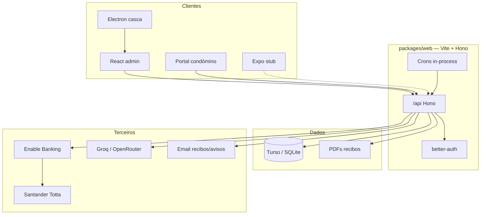
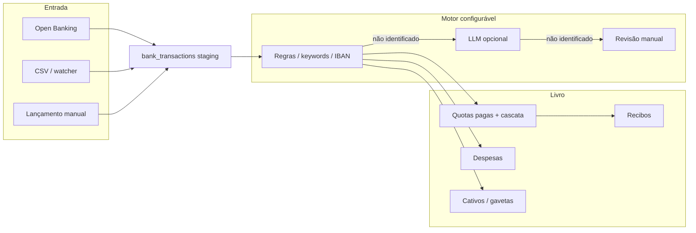
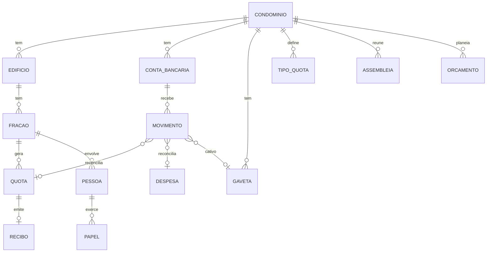
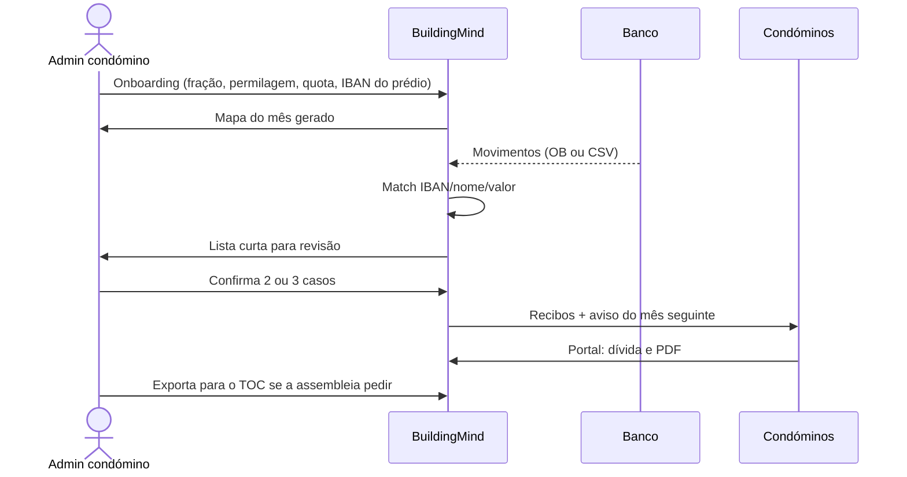
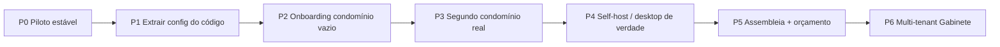

# BuildingMind — dossiê de produto, negócio e implementação

**Versão:** 2026-09-02
**Fonte de código:** `rpcarvalho8/condominio` @ `078665a` (main)
**Nome de trabalho:** BuildingMind (design.md). Nome comercial: **ainda por definir**. UI actual: “Gestão Condomínio” / subtítulo hardcoded “Urb. da Fonte”.
**Piloto:** urbanização mista com habitação, lojas e garagens (referida no código como Condomínio 7663). 33 frações, várias entradas, quotas ordinárias + extras (obras, incêndio, motor/portão, elevadores/INDAQUA), fundo de reserva a 10%.

Este documento **não inventa um segundo produto**. Parte do que já está construído e do que o README da v2 já apontava como próximos passos, e **ajusta o rumo** para o objectivo de mercado: *todos os tipos de condomínio, simplicidade, independência de terceiros*.

As notas do fundador em `NOTAS.md` sobrepõem-se a este dossiê.

---

## 0. Síntese executiva

O código actual **não é um SaaS de condomínios**. É um **sistema operativo financeiro de um condomínio concreto**, já em uso operacional: Open Banking (Enable Banking → Santander Totta / Empresas), motor de reconciliação (matriz de identidade + LLM), recibos PDF, portal do condómino, morosos, despesas, fornecedores, crons de fecho de mês.

Isso é uma vantagem e um risco.

- **Vantagem:** o problema difícil (dinheiro a entrar no banco → quem pagou o quê → gavetas legais → recibo) já foi sofrido no mundo real, não num mock.
- **Risco:** a lógica do piloto está **queimada no código** (orçamentos, âncoras de saldo, IBANs, nomes de gavetas, 33 frações, Santander). Outro condomínio não consegue “ligar e usar”.

O negócio que faz sentido, dado o objectivo de reduzir terceiros, **não é “mais uma ferramenta para administradoras”**. É:

> **O livro-razão do condomínio vive no próprio condomínio.** O administrador-condómino (ou uma administradora que aceite transparência) opera sobre a verdade do banco, não sobre um Excel que só o prestador entende.

Posicionamento: **infraestrutura de auto-gestão**, não substituição total de um síndico profissional em prédios que o queiram. O produto torna a administradora *opcional*, não obrigatória.

---

## 1. Contexto que existe hoje (inventário honesto)

### 1.1 Repositórios e linhagem

```
condominio_buildingmind_v2     → snapshot / origem Runable
        ↓
condominio (repo activo)       → produção do piloto + Enable Banking a funcionar
```

- `condominio_buildingmind_v2` README: JWT+bcrypt, sync Banco CTT a 422, nome por definir, multi-condomínio ainda na lista de “próximos passos”.
- `condominio` README (2026-07-18): reescrito após debug profundo da integração bancária; **Santander Totta via Enable Banking ligado e testado**. Auth = better-auth (cookies).

Há um PR draft `chore(env): Cloud Agent development environment` (`cursor/setup-cloud-agent-env-04f3`). Sem issues. Sem releases.

Origem de template: `website.config.json` ainda diz “Runable”; `package.json` raiz chama-se `sandbox-app-template`; mobile Expo `com.appId.runable`. Dívida de identidade.

### 1.2 Stack

| Camada | Tecnologia |
|--------|------------|
| Runtime | Bun 1.3 |
| API | Hono, `basePath("api")`, `packages/web/src/api/` |
| UI admin | React 19 + Vite 7 + Tailwind + Wouter |
| Dados | Turso / LibSQL via Drizzle (SQLite). Dev: `file:./local.db` |
| Auth | better-auth (sessão cookie; ainda há vestígios de Bearer `bm_token` no frontend) |
| Banco | Enable Banking (PSD2), ASPSP `Santander Totta`, sessão ~90 dias, **só polling** (sem webhooks) |
| LLM opcional | Groq / OpenRouter — camada 2 de identificação de movimentos |
| Desktop | Electron (shell; aponta para a web app) |
| Mobile | Expo — **stub** (ecrã “Welcome” + health check) |
| Design | Dark dashboard, Poppins, accent azul (`design.md`) — identidade “BuildingMind” |

Um único processo Vite serve API e frontend na porta 4200.

### 1.3 O que está implementado (módulos)

| Módulo | Estado real | Notas |
|--------|-------------|--------|
| Auth admin / condómino | ✅ | better-auth; portal separado para role não-admin |
| Frações e proprietários | ✅ | CRUD; tipos apartamento/loja/garagem |
| Quotas mensais + extras | ✅ | tipos configuráveis em BD *e* hardcodes no motor |
| Recibos PDF + cron mensal | ✅ | fecho 23:59 último dia; envio lote dia 1 00:00 |
| Notas de cobrança / avisos | ✅ | pré-geradas no fecho, enviadas no dia 1 |
| Despesas | ✅ | |
| Fornecedores | ✅ | |
| Morosos | ✅ | badge na sidebar via React Query |
| Relatório financeiro mensal | ✅ | cron fim do mês |
| Portal do condómino | ✅ web | quotas, recibos, dívida da **sua** fração. Sem assembleias, sem documentos, sem chat |
| Sync bancário Open Banking | ✅ piloto | Santander; histórico ~89 dias |
| Import CSV Santander | ✅ | fallback sem Open Banking |
| Watcher de pasta CSV | ✅ | agente local |
| Matriz de identidade + auto-learn IBAN | ✅ | **específica do piloto** |
| Cascata de amortização de dívidas | ✅ | obras → incêndio → indaqua → motor |
| Cativos (gavetas na conta à ordem) | ✅ | regras regex do piloto |
| Multi-condomínio | ❌ | um tenant = um edifício = a BD inteira |
| Assembleias / actas | ❌ | só exemplo no SETUP.md |
| Orçamento anual genérico | ❌ | constantes no código do piloto |
| Seguros (apólices) | ❌ | listado na v2, não existe |
| App mobile condómino | ❌ | stub |
| Onboarding de um condomínio novo | ❌ | import Excel 2026 do piloto |
| Nome + domínio de produto | ❌ | |

### 1.4 Modelo de dados (as-is)

Tabelas em `packages/web/src/api/database/schema.ts`:

- Identidade: `user`, `account`, `session` (better-auth)
- Prédio: `fracoes` (quota mensal, permilagem, tipo, IBANs conhecidos, dívidas extra por tipo)
- Dinheiro: `quotas`, `quota_tipos`, `despesas`, `fornecedores`, `recibos`
- Banco: `bank_connections`, `bank_sync_logs`, `bank_transactions` (staging + reconciliação)
- Operação: `import_logs`, `configuracoes` (chave-valor de saldos)

**Não existe** `condominio_id`. Tudo é global. Multi-tenant implica schema breaking change.

Campos à frente do produto: `recibos.hashSha256` / `txHash` (“blockchain-ready”) — **não são prioridade de mercado**; não vender isto.

### 1.5 Superfície da aplicação (rotas)

**Público:** `/login`

**Condómino:** `/portal`

**Admin:** `/` dashboard, `/fracoes`, `/quotas`, `/morosos`, `/despesas`, `/fornecedores`, `/recibos`, `/relatorios`, `/movimentos-bancarios`, `/utilizadores`, `/quota-tipos`, `/importar`, `/definicoes`

API correspondente em `packages/web/src/api/index.ts` (+ `/avisos`, `/identity`, `/setup`, `/seed`, `/health`).

### 1.6 O piloto, em números de domínio

Constantes em `identity-matrix.ts` (não copiar dados pessoais para documentação):

- 33 frações; entradas 21 / 37 / 39 + garagem + lojas
- Tipos: habitação, loja, garagem
- Quota ordinária = condomínio + fundo reserva (10%)
- Extras com orçamento de assembleia: motor 707,25 € · incêndio 2.644,50 € · elevadores 6.958,18 € · obras 50.550,04 €
- Âncoras de saldo físico (15/06/2026): CC, FR, elevadores, obras — **propositadamente a não usar o saldo Enable Banking**, que divergia do extrato real
- Banco: Santander Empresas; conta à ordem + depósitos a prazo por gaveta
- Conceito de **cativo**: dinheiro já na CC mas legalmente de outra gaveta, ainda não transferido para o DP

Este piloto **já é um condomínio “difícil”**: misto, várias entradas, várias gavetas, dívidas históricas, pagamentos que amortizam em cascata. Se o produto genérico aguentar este caso, aguenta um prédio de 8 frações com uma única quota.

### 1.7 Fluxos automáticos já existentes

1. Arranque do servidor: rehydrate dívidas da BD → sync bancário.
2. Cron banco: 08:00 e 20:00.
3. Último dia do mês 23:59: recibos do mês que fecha + notas de cobrança do mês seguinte (PDF, sem email).
4. Dia 1, 00:00: lote unificado email (recibo + cobrança) por fração com email.
5. Dashboard só “abre” faturação do mês novo a partir do dia 1.

### 1.8 Documentação técnica já escrita (não perder)

| Ficheiro | Conteúdo |
|----------|----------|
| `README.md` | Stack real, env Enable Banking, incidentes de debug (9 casos), fluxo `/api/bank/*` |
| `SETUP.md` | Dev local, mapa de pastas, **exemplo** de feature Assembleias (não implementada). Contém credenciais de exemplo Turso — **rodar / não copiar** |
| `design.md` | Direcção visual BuildingMind |
| `audit.md` | Bugs de `recalcularSaldos` (fundo reserva LIKE, defaults stale, badge morosos) |
| `docs/auditoria-2025.report/` | Encerramento “produção ✅” no commit `7471e3d` (ciclo sync → UI) |
| `task.md` | Bug UX fração L (sinais/cores de pagamentos não registados) — checklist por fechar |

### 1.9 Dívida e riscos que o negócio tem de conhecer

1. **Produto = um edifício.** Sem `condominioId`, sem wizard, matriz e cativos no código-fonte.
2. **PII no git.** A matriz de identidade tem nomes de proprietários e IBANs num repositório **público**. Bloqueio RGPD e de confiança comercial. Tratar como incidente: tirar do git, rodar o que for preciso, passar a dados só na BD do tenant.
3. **Chave Enable Banking já esteve commitada** (incidente documentado no README). Histórico git ainda pode a conter.
4. **Vendor lock-in actual:** Turso + Enable Banking + Groq/OpenRouter. Contradiz “reduzir terceiros” se o condomínio não puder trabalhar só com CSV + SQLite local + desktop.
5. **Auth híbrida:** cookie better-auth vs `Authorization: Bearer` + `localStorage bm_token` no Layout/portal — frágil.
6. **Mobile e desktop** não são produto; são cascas.
7. **Saldos âncora vs Open Banking:** o piloto não confia no saldo da API. Qualquer produto tem de permitir âncora manual (extrato em papel / PDF) como fonte de verdade.
8. `SETUP.md` e scripts ainda referem caminhos `/home/user/Condominio-7663`.

---

## 2. Problema de mercado (Portugal)

### 2.1 A gestão de condomínio hoje

Na propriedade horizontal portuguesa o administrador **pode ser um condómino** (Código Civil, administração do condomínio) ou uma empresa. Na prática:

- Prédios pequenos: um vizinho com um Excel, um grupo de WhatsApp, e um contabilista que aparece na assembleia.
- Prédios médios/grandes: administradora que cobra por fração, concentra a informação, e o condómino só vê a “nota de cobrança”.
- Urbanizações mistas (o piloto): várias gavetas, obras, seguros, extra-quotas — o Excel torna-se incompreensível e a administradora torna-se “dona da verdade”.

Dor comum, independentemente do tipo de prédio:

1. Ninguém sabe se o vizinho pagou sem perguntar a um terceiro.
2. O extrato bancário não bate certo com o mapa de quotas (descritivos maus, um pagamento a cobrir três dívidas).
3. Trocar de administradora é quase migrar de religião: os dados não saem.
4. O administrador-condómino honesto passa noites a fazer trabalho de tesoureiro.
5. O condómino comum não tem um sítio único, simples, com a *sua* dívida e os *seus* recibos.

### 2.2 Tipos de condomínio que o produto tem de cobrir

O objectivo “todos os tipos” **não** significa um SKU por tipologia. Significa um **modelo de domínio parametrizável**:

| Tipo | O que muda | O que não muda |
|------|------------|----------------|
| Prédio habitacional pequeno (2–12 frações) | Uma quota, um IBAN, administrador vizinho | Banco → fração → recibo |
| Prédio médio (12–80) | Mais morosos, mais fornecedores | Idem |
| Urbanização / vários blocos | Entradas, zonas comuns partilhadas, permilagens | Idem + estrutura hierárquica opcional |
| Misto (lojas + habitação) | Quotas diferentes, horários, extra-quotas | Tipos de fração |
| Só garagens / só lojas | Sem “andar”, permilagem atípica | Fração continua a ser a unidade de cobrança |
| Moradias / condomínio fechado | Zonas comuns (piscina, portaria) como centros de custo | Despesas + orçamento |
| Turístico / AL no prédio | Contacto do explorador ≠ proprietário | Dois papéis na mesma fração |
| Escritórios / industrial em PH | Fornecedores e contratos diferentes | Mesmo motor financeiro |

**Regra de desenho:** a unidade atómica é sempre a **fração** (ou unidade de cobrança) com permilagem opcional. Tudo o resto é configuração: tipos de quota, gavetas, contas bancárias, papéis.

### 2.3 Dependência de terceiros — o que o produto ataca

| Terceiro | Dependência actual no mercado | Como o produto reduz |
|----------|-------------------------------|----------------------|
| Administradora | Opera, guarda, explica | O condomínio opera; a administradora passa a opcional |
| Contabilista operacional | Recategoriza o banco no Excel | Reconciliação automática + âncora de saldo |
| Banco “humano” (ir ao balcão, CSV no email) | Open Banking *ou* CSV arrastado *ou* pasta vigiada | Três caminhos; nenhum obrigatório |
| WhatsApp | Arquivo e cobrança informal | Portal + email de recibo/cobrança |
| “O gajo do Excel” | Única pessoa que percebe as contas | Motor + relatórios + export completo |
| Vendor SaaS | Dados reféns | Desktop + SQLite + export; cloud opcional |

**Não** se promete eliminar: banco, seguradora, empresas de manutenção, autoridade tributária, advogado em litígio. Reduz-se a dependência **de quem gere informação**.

---

## 3. Visão de produto (ajustada ao mercado)

### 3.1 Promessa

**BuildingMind** (nome TBC) é o sistema com que um condomínio português gere dinheiro, pessoas e obrigações legais **sem precisar de uma administradora para saber a verdade**.

Três verbos:

1. **Ver** — saldos, gavetas, quem deve, o que o banco diz.
2. **Cobrar** — quotas, extras, recibos, avisos, portal.
3. **Prestar contas** — orçamento vs realizado, assembleia, exportação para o contabilista *se* for preciso.

### 3.2 Princípios (produto)

1. **O banco é a evidência; a âncora humana é a verdade quando divergem.** O piloto já aprendeu isto.
2. **Configuração, não fork.** Um condomínio novo não deve exigir um `identity-matrix.ts` novo.
3. **Um condómino consegue administrar.** Se precisares de formação de TOC para emitir um recibo, falhámos.
4. **Os dados são do condomínio.** Exportar tudo (CSV/SQLite/PDF) é feature de dia 1 do produto, não um extra.
5. **Terceiros são plug-ins.** Open Banking, LLM, cloud: ligam-se. O núcleo funciona com CSV + um administrador.
6. **Um modelo, N tipos de fração.** Não ramificar o código em “módulo lojas”, “módulo garagens”.
7. **Privacidade por omissão.** Nada de PII no código nem em repos públicos.

### 3.3 Personas

| Persona | Quer | Não quer |
|---------|------|----------|
| **Administrador-condómino** (ICP principal) | Fechar o mês em 20 minutos, não ser refém da administradora | Contabilidade de empresa, dashboards de vanity |
| **Condómino** | Saber o que deve, pagar, descarregar recibo | App com 40 ecrãs |
| **Tesoureiro da comissão** | Gavetas e cativos claros | Confiar num saldo “API” que não bate com o papel |
| **Administradora pequena** (ICP secundário) | Gerir 10 prédios com a mesma ferramenta, mostrar transparência como argumento de venda | Perder o cliente porque o software é do condomínio — mitigar com multi-tenant *e* export |
| **Contabilista** | Extrato já reconciliado no fecho do ano | Entrar no dia-a-dia |

### 3.4 Não-objectivos (para não inchar)

- Marketplace de fornecedores
- Blockchain de recibos
- Chat/rede social do prédio (v1)
- Substituição do TOC na IES
- App nativa polida antes do portal web mobile-friendly estar excelente

---

## 4. Business plan

### 4.1 Oferta

**Núcleo (todos os condomínios):**
- Cadastro de frações e pessoas
- Tipos de quota e permilagem
- Mapas de cobrança e morosos
- Recibos e avisos
- Despesas e fornecedores
- 1..N contas bancárias (CSV obrigatório; Open Banking opcional)
- Reconciliação configurável (regras + aprendizagem de IBAN; LLM opcional)
- Portal do condómino
- Exportação total

**Extensões (quando o núcleo estiver genérico):**
- Assembleias: convocatória, quorum, acta, lista de presenças
- Orçamento anual vs realizado
- Seguros e datas de renovação
- Documentos do condomínio (título constitutivo, regulamento)
- Multi-edifício / multi-tenant
- Mobile nativo (só depois do portal estar perfeito no telemóvel)

### 4.2 Modelo de receita (proposta — ajustar em NOTAS.md)

Princípio: **o condomínio paga, não cada vizinho à peça**, para não criar fricção na assembleia. Self-host / desktop barato ou grátis para prédios minúsculos — isso *é* o argumento “independência”.

| Plano | Cabe a | Inclui | Preço de trabalho (a validar) |
|-------|--------|--------|-------------------------------|
| **Casa** | 2–12 frações, admin vizinho | Núcleo + CSV + SQLite local/desktop | 0 € self-host / ou token anual simbólico |
| **Prédio** | 13–80 frações | Núcleo + Open Banking + emails + cloud | Assinatura mensal por condomínio (banda 20–49 €) **ou** 0,80–1,50 €/fração/mês, o que for mais simples de votar em assembleia |
| **Urbanização** | Vários blocos, gavetas, várias contas | Tudo o do Prédio + multi-conta + cativos | Preço Prédio × complexidade (contas/gavetas), não × marketing |
| **Gabinete** | Administradora / vizinho que gere 2+ prédios | Multi-tenant, separação de dados | Por condomínio activo, com desconto de volume |

Receita que **não** perseguir cedo: take-rate em pagamentos (MB Way, etc.) — aumenta dependência de terceiros e compliance.

### 4.3 Go-to-market

1. **Piloto público (Urb. da Fonte)** — o produto tem de continuar a servir *este* prédio enquanto se extrai configuração. O piloto é o laboratório, não o único cliente.
2. **Segundo condomínio diferente de propósito** — prédio pequeno, uma quota, outro banco, CSV only. Se o wizard não chegar, o produto ainda não existe.
3. **Canal:** assembleias, grupos de administradores-condóminos, associações de proprietários, contabilistas que *não* querem fazer tesouraria. Não começar por feiras de administradoras (elas compram software que as entroniza).
4. **Mensagem:** “As contas do prédio deixam de viver na pasta da administradora.”
5. **Anti-mensagem:** “IA para condomínios.” O LLM é muleta de descritivos bancários, não o produto.

### 4.4 Concorrência (enquadramento)

Ferramentas PT/ES e administradoras digitais (o mercado muda de nome com frequência): plataformas para **empresas de administração**, portais do condómino acoplados à administradora, Excel+WhatsApp.

**Diferenciação sustentável, se for verdade:**

- Feito primeiro para quem **não quer** administradora
- Banco → gavetas → recibo como coração, não um módulo
- Saída de dados trivial (anti-lock-in) — irónico e comercialmente honesto
- Prova de fogo num misto real, não num demo de 4 apartamentos

### 4.5 Conformidade (não é pormenor)

- **RGPD:** PII de proprietários; base de dados por condomínio; direito de exportação/apagamento; repo público actual é incompatível.
- **PSD2 / Open Banking:** consentimento por conta, expiração de sessão, reconnect UX (já parcialmente feito).
- **Propriedade horizontal:** fundo comum de reserva, permilagem, assembleia, administrador. O software não é a lei, mas os vocabulários têm de ser os da lei PT (fração, permilagem, quota, fundo de reserva, acta).
- **Recibos:** numeração, PDF, arquivo; não improvisar “blockchain” como substituto de arquivo legal.

### 4.6 Riscos de negócio

| Risco | Mitigação |
|-------|-----------|
| Ficar para sempre o software da Urb. da Fonte | Segundo piloto obrigatório antes de marketing |
| Enable Banking / um só banco | CSV como caminho de primeira classe; lista de ASPSP PT quando Open Banking existir |
| Administradoras como inimigas | Plano Gabinete para as que vendem transparência; o condomínio continua dono dos dados |
| Confiança financeira (um cêntimo errado mata o produto) | Âncoras, reconciliação com revisão manual, nada de “IA disse que está pago” sem rasto |
| PII no GitHub | Limpeza de histórico + dados só em BD |
| Duas cabeças (trading vs condomínio) | Repos e conversas separados — já é política desta revisão |

---

## 5. Diagramas

### 5.1 Arquitectura as-is (piloto)



### 5.2 Pipeline de dinheiro (o coração do produto)



### 5.3 Domínio alvo (genérico, todos os tipos)



Papéis na fração (para cobrir AL, usufruto, inquilino, loja arrendada): **proprietário**, **pagador**, **ocupante**, **contacto de cobrança**. O piloto só tem proprietário.

Gaveta ≠ tipo de quota: a gaveta é um **destino de dinheiro** (CC, FR, obras, seguro…). Um tipo de quota aponta para uma gaveta. Um condomínio pequeno tem 1–2 gavetas; uma urbanização tem N. Isto substitui `ORCAMENTO_MOTOR` hardcoded.

### 5.4 Jornada do administrador-condómino (alvo)



### 5.5 De piloto a produto (estados)



---

## 6. Gap analysis — o que impede “qualquer condomínio”

| Área | Hoje | Precisa de ser |
|------|------|----------------|
| Tenant | 1 BD = 1 prédio implícito | `condominio` como raiz; tudo o resto com FK |
| Identidade de frações | Array TypeScript com PII | Tabelas `fracoes` + IBANs; zero PII no git |
| Orçamentos extra | Constantes `ORCAMENTO_*` | Tipos de quota + gavetas + período |
| Âncoras de saldo | Constantes de junho 2026 | Configuração por conta, com data e valor |
| Cativos | Regex do piloto | Regras por condomínio (UI em Definições) |
| Banco | Santander Totta + nomes de campos | Conector Open Banking genérico + CSV genérico (não só Santander) |
| LLM prompt | “Condomínio 7663” | Prompt com a lista **da BD** daquele tenant |
| Cascata | obras/incêndio/indaqua/motor | Ordem de amortização configurável por tipo de dívida |
| UI nome do prédio | “Urb. da Fonte” no Layout | `condominio.nome` |
| Onboarding | `import-excel-2026.ts` | Assistente: N frações, permilagem, quota, 1 IBAN |
| Independência cloud | App pensa em Turso | Perfil `file:local.db` + Electron a **guardar** a BD, não só a abrir um URL |
| Mobile | Stub | PWA / portal responsivo primeiro |
| Assembleias | Inexistente | Módulo depois do dinheiro estar genérico |
| Design system | Dois Button.tsx | Irrelevante para o negócio; não bloquear |

---

## 7. Plano de implementação

Princípio: **não parar o piloto**. Cada fase tem de deixar a Urb. da Fonte a funcionar com a *mesma* lógica, só que lida de configuração em vez de constantes.

### P0 — Higiene para poder vender um dia

- Remover PII e segredos do tree e do histórico público (IBANs, nomes, `.pem`).
- Rodar chaves Enable Banking / Turso que tenham estado expostas.
- Identidade: um nome de produto no README, Layout, `package.json`, mobile bundle — mesmo que provisório.
- Fechar os itens abertos de `task.md` / `audit.md` que distorcem confiança nos números (fundo reserva, cores de “pagamentos não registados”).
- Documentar o perfil de dados do piloto como **fixture de seed**, não como código de produção.

### P1 — Extrair o piloto para configuração (o passo que cria o produto)

Mover para BD (ou JSON de tenant, se ainda for single-node):

- Nome, morada, NIF do condomínio
- Lista de gavetas e contas bancárias
- Âncoras por conta
- Tipos de quota (keywords, valor base, permilagem sim/não, gaveta destino)
- Ordem da cascata
- Regras de cativo
- `TOTAL_FRACOES` derivado da BD

O ficheiro `identity-matrix.ts` passa a **carregar da BD** (a função `rehydrateDividasFromDB` já aponta nessa direcção). O array hardcoded morre.

Entrega: o piloto corre *sem* constantes de orçamento no git, e um dump da BD reproduz o comportamento.

### P2 — Condomínio vazio utilizável

Wizard:

1. Nome do condomínio
2. Criar frações (número, tipo, permilagem, quota, email)
3. Uma conta bancária (IBAN) e uma âncora de saldo
4. Um tipo de quota “Condomínio” + fundo reserva % (default 10, editável)
5. Importar CSV de 30 dias **ou** ligar Open Banking se o banco existir na lista
6. Primeiro mapa de cobrança

Sem Excel 7663. Sem LLM obrigatório. Revisão manual é primeira classe.

Este é o critério “simples”.

### P3 — Segundo condomínio real (prova de mercado)

Escolher de propósito o oposto do piloto: poucas frações, um banco diferente ou só CSV, sem obras faraónicas.

Tudo o que quebrar é backlog de P1/P2, não feature nova.

### P4 — Independência de terceiros (tecnologia)

- CSV + regras sem Enable Banking = caminho oficial, testado, com UI tão boa como o botão “Conectar banco”.
- Desktop: a BD SQLite **é** o ficheiro do condomínio; backup = copiar o ficheiro.
- Export: um ZIP com CSV de todas as tabelas + PDFs.
- LLM desligado por omissão; ligar só se o admin quiser.
- Open Banking: vários ASPSP PT, não um.
- Documentar o que acontece quando a sessão PSD2 caduca (`needsReconnect` já existe).

### P5 — Gestão que não é só tesouraria

Só depois do dinheiro genérico:

- Assembleias (o SETUP.md já descreve o caminho de feature)
- Orçamento anual vs realizado (hoje o dashboard mistura saldos do piloto)
- Arquivo: regulamento, título constitutivo, apólices
- Portal: além de dívida/recibo, ver acta e orçamento aprovado

Isto é o que faz o vizinho **não precisar** da administradora para a vida legal mínima do prédio.

### P6 — Multi-tenant / Gabinete

- `condominio_id` em todas as tabelas de domínio
- Um login pode administrar N condomínios
- Isolamento rigoroso no portal do condómino
- Ainda assim: cada condomínio exporta-se sozinho (anti-refém)

Não fazer P6 antes de P2/P3 — multi-tenant em cima de hardcodes replica o piloto N vezes.

### Ordem do que *não* fazer agora

- Reescrever a stack (Next, Prisma, microserviços)
- App Store / EAS production
- Blockchain de recibos
- Marketplace
- Fundir este repo com `App_trade`

---

## 8. Implicações no código actual (mapa para a nova conversa)

Quando se implementar, os sítios inevitáveis:

| Sítio | Problema | Direcção |
|-------|----------|----------|
| `lib/identity-matrix.ts` | Fonte de verdade no git + PII | Ler `fracoes` + tabelas novas de âncora/orçamento |
| `lib/cativo-rules.ts` | Regras do piloto | Tabela `regras_cativo` por condomínio |
| `lib/llm-fallback.ts` | Prompt 7663 | Prompt dinâmico |
| `routes/dashboard.ts` | `SALDO_DEFAULTS` / lógica de gavetas do piloto | Defaults a zero; valores só de config/BD |
| `routes/bank.ts` | ASPSP e importação | Manter Enable Banking; abstractar “fonte de movimentos” |
| `components/Layout.tsx` | Nome do prédio | Config |
| `scripts/import-excel-2026.ts` | Onboarding do piloto | Fica como migração histórica, não como caminho de produto |
| `schema.ts` | Sem tenant, sem assembleia, sem gavetas explícitas | Evolução Drizzle com migrações; o piloto migra in-place |
| `packages/desktop` | Browser wrapper | Modo offline com `file:` DB |
| `packages/mobile` | Stub | Esperar pelo portal responsivo |

---

## 9. Critérios de aceite do produto de mercado

Um condomínio **nunca visto pelo autor do piloto** consegue, sem alterar TypeScript:

1. Criar o prédio e as frações
2. Definir uma quota e um fundo de reserva
3. Importar um CSV bancário (qualquer banco razoável, não só Santander)
4. Reconciliar com revisão manual
5. Emitir recibos
6. Abrir o portal a um condómino
7. Exportar tudo e apagar a conta

Quando isto for verdade, “todos os tipos de condomínio” passa a ser **configuração de frações e gavetas**, não um roadmap infinito.

---

## 10. Relação com o que a v2 já pedia

O README da v2 listava: nome, domínio, notificações email, multi-condomínio, mobile, orçamento anual, actas, seguros.

Este dossiê **não descarta** essa lista. Reordena-a:

- Email de recibos/avisos: **já existe** no repo activo.
- Nome/domínio: P0.
- Multi-condomínio: P6, depois de o single-tenant ser genérico.
- Orçamento / actas / seguros: P5.
- Mobile: depois do portal no telemóvel.

O que a v2 **não** dizia, e agora é o centro: **independência de terceiros** e **configuração em vez de fork do piloto**.

---

## 11. O que este dossiê não tem (limitações desta revisão)

- Não há Drive/Gmail autenticados neste agente — as tuas notas pessoais **não foram lidas**; por isso existe `NOTAS.md`.
- Não há business plan anterior no git; o capítulo 4 é proposta, não histórico.
- Não se acedeu à BD Turso de produção; números de orçamento/âncora vêm do código.
- Não se reabriu o histórico completo de commits além do HEAD `078665a` e da auditoria `7471e3d`.
- Não se criou uma nova conversa Cursor (o agente não consegue spawnar chats). O ficheiro `PROMPT-NOVA-CONVERSA.md` serve para a abrires tu.
- Este dossiê foi gravado em `App_trade` / `docs-condominio/` porque o agente da conversa de trading **não tem permissão de escrita** em `rpcarvalho8/condominio`. O código da app continua nesse repo.

---

## 12. Próximo passo recomendado (humano)

1. Abrir a nova conversa com o prompt em `PROMPT-NOVA-CONVERSA.md`.
2. Colar as notas de mercado em `NOTAS.md`.
3. Só então pedir ajustes a este dossiê (preço, nome, ICP, o que é inegociável).
4. Não pedir implementação de P1 na conversa de trading nem neste repo errado.
